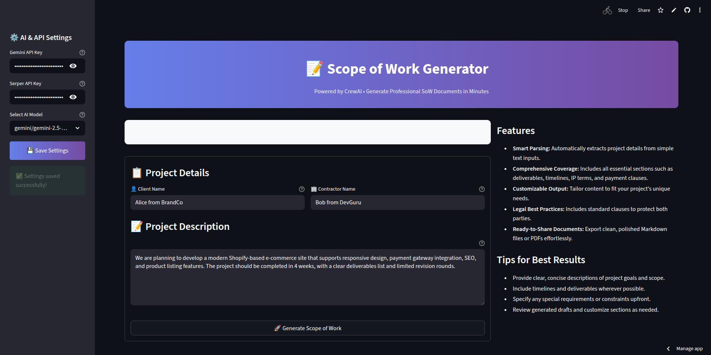
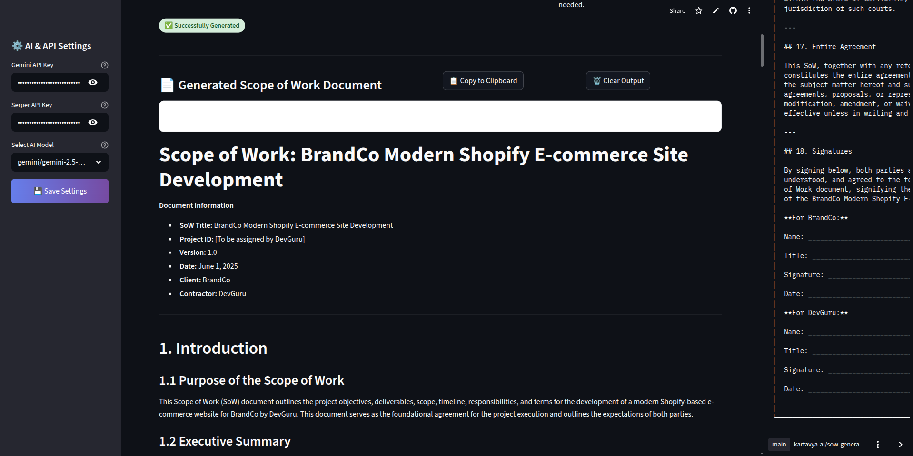

# 📄 AI-Powered Scope of Work (SoW) Generator using CrewAI

<p align="center">
  <a href="https://streamlit.io" target="_blank">
    
  </a>
  <a href="https://github.com/joaomdmoura/crewAI" target="_blank">
    
  </a>
  <a href="https://github.com/yourusername/sow-generator/fork" target="_blank">
    
  </a>
</p>

Craft professional, legally sound Scope of Work (SoW) documents — instantly and effortlessly.

This intelligent tool leverages the power of [CrewAI](https://github.com/joaomdmoura/crewAI) to automate the entire SoW creation process. From parsing messy, unstructured input to generating clean, contract-ready deliverables, it uses a team of collaborative AI agents to do the heavy lifting.

💼 Perfect for freelancers, agencies, and businesses needing to formalize project terms quickly — without legal headaches or template juggling.



---

### ⚡ What’s Inside?

- **No templates. No boilerplate. Just smart AI.**
- Designed for **clarity, legal safety, and professionalism**
- Generates detailed SoWs with sections like:
  - Project Overview
  - Deliverables
  - Timelines
  - Payment Terms
  - IP Ownership
  - Confidentiality & Revisions

Let the AI handle the paperwork — so you can focus on your work.

## 🚀 What It Does

**This tool helps you:**

- ✅ Parse unstructured client input
- ✅ Build a formalized SoW outline
- ✅ Generate polished, sectioned content
- ✅ Add legal and financial clauses
- ✅ Format the output in Markdown (PDF-ready)

Whether you're a freelancer, agency, or enterprise team — this app saves hours of back-and-forth and manual writing.

---

## 🧠 Powered by CrewAI Agents

The system uses a sequence of specialized agents:

| Agent            | Role                                                         |
| ---------------- | ------------------------------------------------------------ |
| 🧾 InputParser   | Extracts structured data from raw user text                  |
| 🗂️ ScopeBuilder  | Designs a formal SoW structure with all relevant sections    |
| ✍️ ContentWriter | Fills each section with context-aware content                |
| ⚖️ PolicyAgent   | Adds clauses for IP, confidentiality, revisions, and payment |
| 🔍 QualityCheck  | Reviews clarity, structure, and professionalism              |
| 🎨 Formatter     | Outputs clean, shareable Markdown                            |

---

## ✨ Features

- **🧠 AI-Powered Generation**: Built on CrewAI with support for Gemini and Serper APIs
- **📋 Full Document Coverage**: Objectives, Deliverables, Payment Terms, IP Rights, etc.
- **🛡️ Legal Clauses Built-In**: Contracts you can trust
- **📄 PDF-Ready Markdown Output**: Clean and shareable results
- **🧩 Configurable Agents & Tools**: Easily extend or customize

---

## 📂 Project Structure

```
├── app.py              # Streamlit app UI and main entry point
├── app_ui1.png         # Screenshot of the input form UI
├── app_ui2.png         # Screenshot of the generated SoW document
├── pyproject.toml      # Project metadata & dependencies
├── README.md           # This documentation file
├── requirements.txt    # Python dependencies
├── src                 # Source code
│ └── sow               # Scope of Work crew modules
│ ├── config
│ │ ├── agents.yaml     # Agent configurations
│ │ └── tasks.yaml      # Task configurations
│ ├── crew.py           # Crew and agents setup
│ ├── main.py           # CLI runner script
│ └── tools             # Custom tools & integrations (e.g., web search)
└── uv.lock             # Dependency lock file
```

---

## Getting Started

### Prerequisites

- Python 3.10+
- (Optional) API keys for Gemini AI and Serper Search to enhance AI and web search capabilities

### 🖥️ Running the App

1. Clone this repository:

```bash
git clone https://github.com/Kartavya-AI/SOW-Generator.git
cd sow-generator
```

2. Install dependencies:
   pip install -r requirements.txt
3. Set your API keys in the Streamlit sidebar
4. Launch the Streamlit app:

```bash
streamlit run app.py
```

- Open the displayed URL in your browser, enter project details, and generate a professional Scope of Work document instantly.

## 📌 Tips for Best Results

- Provide clear, concise project descriptions to improve parsing accuracy.

- Include timelines, deliverables, and any special requirements upfront.

- Review generated drafts carefully and customize if needed.

- Use API keys to enable real-time web search and up-to-date cost estimates.

## Screenshots



## License

This project is licensed under the MIT License.
